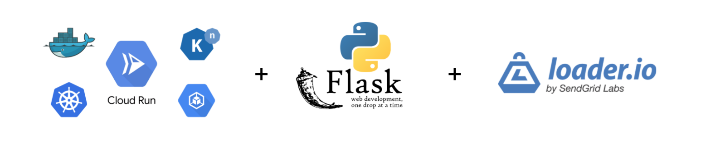
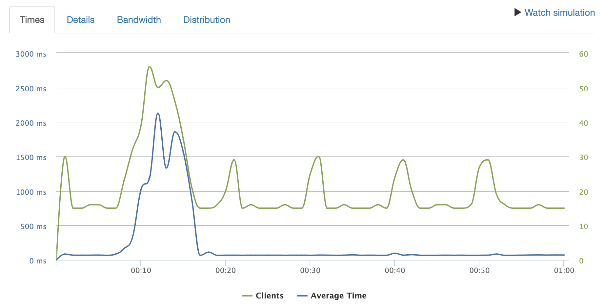
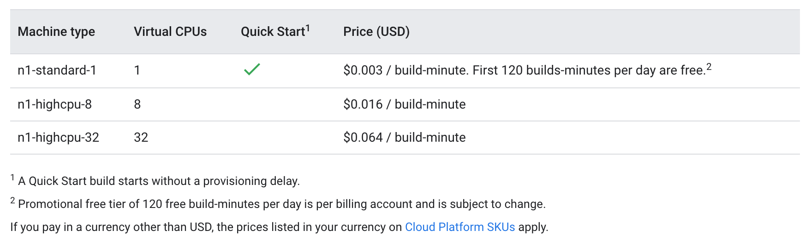

Cloud Run is a GCP service to easily deploy a containerised app on kubernetes, with no infrastructure management and a minimum complexity.

Can you do the same with AWS Fargate/EKS? Yes, but Cloud Run offers an overall [better developer experience](https://thenewstack.io/comparison-aws-fargate-vs-google-cloud-run-vs-azure-container-instances/).

## What

- Helloworld Flask app in Cloud Run (from the [original tutorial](https://cloud.google.com/run/docs/quickstarts/build-and-deploy))
- two scripts to automate the setup and deployment
- load Testing with Loader.io

## Results

This is how the endpoint responds to 1000 requests over 60 seconds.



At first latency increases with the request rate, to drop back down to 70 ms after the cluster was automatically scaled up to meet demand. It's interesting to measure the [curl execution times](https://dev.to/yuyatakeyama/how-i-measure-response-times-of-web-apis-using-curl-6nh) with and without TLS, and compare them to a local Flask app:

```zsh
# Local
ntimes 10 -- curl 127.0.0.1:8080 -s -o /dev/null -w  "%{time_starttransfer}\n" | percentile
# Remote
ntimes 10 -- curl https://xxx.run.app -s -o /dev/null -w  "%{time_starttransfer}\n" | percentile
```

|  percentile | remote (https)   | remote (http) | local |
|------------|----------------|---------------|----------|
| 50%        | 0.35307        | 0.216214      | 0.002455 |
| 75%        | 0.355753       | 0.217467      | 0.002545 |
| 95%        | 0.365906       | 0.223157      | 0.002572 |
| 100%       | 0.437113       | 0.245092      | 0.002623 |

Note that the latency of the http endpoint it comparable to what [gcping](http://www.gcping.com/) reports from Sydney (where I am) to us-central-1 (the cloud run service).

Interestingly a ping from terminal takes only 17 ms. This is expected, since both curl and gcping [use the http protocol](https://github.com/ImJasonH/gcping/blob/master/cmd/ping/main.go#L27), while ping uses [ICMP](https://www.cloudflare.com/learning/ddos/glossary/internet-control-message-protocol-icmp/). If you wan to dig a bit deeper on the differences, Peter Smith wrote a nice article in 2016 titled [how long is a curl?](https://medium.com/galvanize/how-long-is-a-curl-ec59af087ca8) that's worth reading.


## Ingredients

**Cloud Run**

Inputs:

1. the app (business logic)
2. the environment (Dockerfile)

Outputs:

- autoscaling
- scale-to-zero
- security
- concurrency
- release management
- monitoring

**Cloud Builds** is the easy way to build, test, and deploy code in GCP. At the moment the free tier includes 120 minutes of build time per day, hard to exceed for small projects. If you exceed this limit:



**Container Registry**: Private repository of docker images.


## How To
if you haven't done so yet:

- Install the [Google Cloud SDK](https://cloud.google.com/sdk/docs/downloads-interactive) (`gcloud` command)
- read how gcloud [project management](https://www.the-swamp.info/blog/configuring-gcloud-multiple-projects/) works
- Keep an eye on this [gcloud cheet-sheet](https://gist.github.com/pydevops/cffbd3c694d599c6ca18342d3625af97#06-projects)

You might need to authenticate with `gcloud auth login`, which will take you to your browser to complete the sign in with google OAuth flow (`gcloud auth list` to list them all).

**Cloud Build**

List the builds already launched with `gcloud builds list` (should be empty the first time) then build tags and push the image to Google Container Registry with one command from the directory containing the Dockerfile:

```zsh
gcloud builds submit --tag gcr.io/<PROJECT-ID>/helloworld
```

The most likely case of error here is to use the project name instead of the project id (use `gcloud config list` to see the id without leaving the terminal). If it completes successfully you should see the image with `gcloud container images list`.

**Cloud Run**

We can now deploy the service in us-central1, with 1 vCPU, and 80 maximum concurrent requests per container, and open it to the world with the *--allow-unauthenticated* flag:

```zsh
gcloud run deploy helloworld \
--image gcr.io/PROJECT-ID/helloworld \
--platform managed \
--memory 256Mi \
--concurrency 80 \
--region us-central1 \
--allow-unauthenticated

Deploying container to Cloud Run service [helloworld] in project [helloworld-cloud-run-276808] region [us-central1]
✓ Deploying new service... Done.
  ✓ Creating Revision...
  ✓ Routing traffic...
  ✓ Setting IAM Policy...
Done.
Service [helloworld] revision [helloworld-00001-keg] has been deployed and is serving 100 percent of traffic at https://xxx.run.app
```

That's it really. To see the details of this service

```zsh
gcloud run services describe helloworld --platform managed --region us-central1
```

**Load Testing with Loader.io**

[Apache JMeter](https://jmeter.apache.org/download_jmeter.cgi) and this step-by-step guide written by [Chamika Kasun](https://medium.com/@chamikakasun/rest-api-load-testing-with-apache-jmeter-a4d25ea2b7b6) are a great starting point to setup and run some load tests from a local machine. There is mouse-work to set this up and it's a bit hard to collaborate and share results.

A good second option is [Loader.io](https://loader.io/). Loader generates a pseudo-random token which we save in ./static/token.html. We then modify the flask app slightly to serve this file using the method [send_from_directory](https://flask.palletsprojects.com/en/1.1.x/api/?highlight=send_from_directory#flask.send_from_directory) (code stolen from [this thread](https://flask.palletsprojects.com/en/1.1.x/api/?highlight=send_from_directory#flask.send_from_directory)):

```Python
from flask import send_from_directory

@app.route('/<path:filename>')
def serve_static(filename):
    return send_from_directory("./static", filename)
```

we can now run the app locally with `python app.py` and listen to port 8080 for the token file. If the browser displays the token successfully, we can rebuild and push the image with `gcloud builds submit`, and deploy it in cloud run with `gcloud run deploy`.

If everything goes well, we should be able to click on one of the links in Loader to verify the target, and move on to defining the test details.

**Concurrency**

A single container in cloud run can handle a minimum of 1 request at a time, and a maximum of 80. In comparison, Functions-as-a-Service (FaaS) solutions like Cloud Functions have a fixed concurrency of 1. Concurrency and max memory should be [tuned together](https://cloud.google.com/run/docs/tips#tuning-concurrency) to avoid out-of-memory errors.

**Cost**

- Container Registry (same cost as standard buckets in Google Cloud storage) cents/GB.
- Cloud Build (2 h/day and 1 vCPU free, or 18 cents/hour/vCPU).
- Cloud Run 50h @ 1 vCPU, 2 GiB RAM, 2m requests included in the free tier. Beyond that:
  - 8.6 cents/hour/vCPU
  - 0.9 cents/hour/GiB

See the [pricing page](https://cloud.google.com/run/pricing#pricing_table) or use the pricing calculator to create a scenario and estimate costs.)

**Cleaning up**

Delete the service with:

`gcloud run services delete [SERVICE]`

or delete the project all together with

`gcloud projects delete [PROJECT_ID]`
